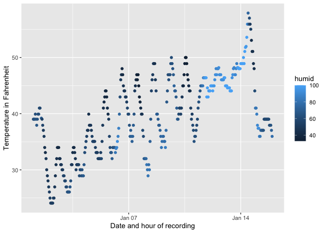

p8105_hw1_lvr2115
================
laura
2023-09-23

# Problem 1

``` r
library(moderndive)
library(tidyverse)
```

    ## ── Attaching core tidyverse packages ──────────────────────── tidyverse 2.0.0 ──
    ## ✔ dplyr     1.1.3     ✔ readr     2.1.4
    ## ✔ forcats   1.0.0     ✔ stringr   1.5.0
    ## ✔ ggplot2   3.4.3     ✔ tibble    3.2.1
    ## ✔ lubridate 1.9.2     ✔ tidyr     1.3.0
    ## ✔ purrr     1.0.2     
    ## ── Conflicts ────────────────────────────────────────── tidyverse_conflicts() ──
    ## ✖ dplyr::filter() masks stats::filter()
    ## ✖ dplyr::lag()    masks stats::lag()
    ## ℹ Use the conflicted package (<http://conflicted.r-lib.org/>) to force all conflicts to become errors

``` r
data("early_january_weather")
str(early_january_weather)
```

    ## tibble [358 × 15] (S3: tbl_df/tbl/data.frame)
    ##  $ origin    : chr [1:358] "EWR" "EWR" "EWR" "EWR" ...
    ##  $ year      : int [1:358] 2013 2013 2013 2013 2013 2013 2013 2013 2013 2013 ...
    ##  $ month     : int [1:358] 1 1 1 1 1 1 1 1 1 1 ...
    ##  $ day       : int [1:358] 1 1 1 1 1 1 1 1 1 1 ...
    ##  $ hour      : int [1:358] 1 2 3 4 5 6 7 8 9 10 ...
    ##  $ temp      : num [1:358] 39 39 39 39.9 39 ...
    ##  $ dewp      : num [1:358] 26.1 27 28 28 28 ...
    ##  $ humid     : num [1:358] 59.4 61.6 64.4 62.2 64.4 ...
    ##  $ wind_dir  : num [1:358] 270 250 240 250 260 240 240 250 260 260 ...
    ##  $ wind_speed: num [1:358] 10.36 8.06 11.51 12.66 12.66 ...
    ##  $ wind_gust : num [1:358] NA NA NA NA NA NA NA NA NA NA ...
    ##  $ precip    : num [1:358] 0 0 0 0 0 0 0 0 0 0 ...
    ##  $ pressure  : num [1:358] 1012 1012 1012 1012 1012 ...
    ##  $ visib     : num [1:358] 10 10 10 10 10 10 10 10 10 10 ...
    ##  $ time_hour : POSIXct[1:358], format: "2013-01-01 01:00:00" "2013-01-01 02:00:00" ...

The dataset is a subset of hourly meterological data from LGA, JFK, and
EWR airports for January 2013. This dataset 358 rows and 15 columns. The
15 variables are day, dewp, hour, humid, month, origin, precip,
pressure, temp, time_hour, visib, wind_dir, wind_gust, wind_speed, year.

The mean of the temperature variable is 39.5821229.

This is a scatterplot showing the temperature at different hours during
days in early January. The color of the data point shows the humidity.
It is apparent that temperature fluctuates during the day and
temperatures increase during the second week and. third week of january
compared to the first.

``` r
ggplot(early_january_weather, aes(x = time_hour, y = temp, color = humid)) + geom_point()
```

<!-- -->

``` r
ggsave('temp_plot.png', width=6, height=4,dpi=300)
```

# Problem 2

This code chunk creates a data frame comprised of a random sample of
size 10 from a standard Normal distribution, a logical vector indicating
whether elements of the sample are greater than 0, a character vector of
length 10, and a factor vector of length 10, with 3 different factor
“levels”.
